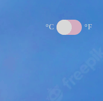
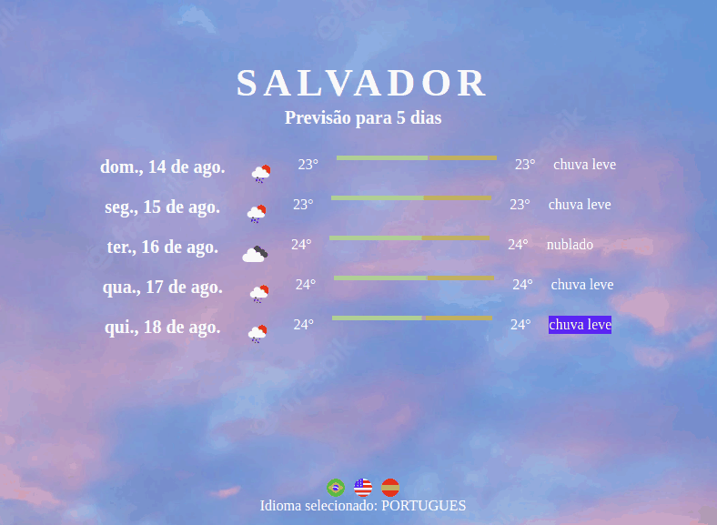

# Previsão do Tempo	:cloud_with_rain:	:sunny: :partly_sunny: 	:cloud_with_lightning_and_rain:

## Esse é um modesto website para consultar a previsão do tempo de qualquer cidade do mundo
<https://evertonnasac.github.io/previsao-do-tempo/>

### Resultados:

* Previsão do tempo atual, com temperaturas mínima e máxima
* Previsão com mímina e máxima pelos próximos 5 dias

### Funcionalidades: 

* O auto complete no campo cidade ajuda a buscar por locais mais precisos: 

* Selecionar a unidade de medida (celsius ou fahrenheit): 

* Selecionar o idioma (inglês, espanhol e portugues-BR): 

Foi utilizada a API Open Weathermap <https://openweathermap.org/api> para buscar os dados sobre a previsão do tempo  
e a API Nominatim <https://nominatim.org/release-docs/latest/> para buscar a localização precisa do lugar a ser consultado e implementar o autopreenchimento no campo cidade.

Desenvolvido com: 

 

